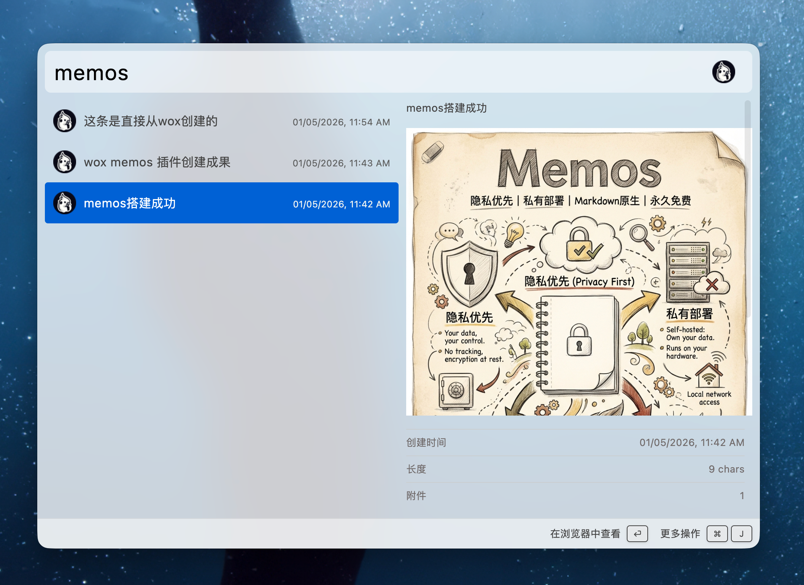

# Wox.Plugin.Memos

Wox plugin for [Memos](https://github.com/usememos/memos) - A privacy-first, lightweight note-taking service.



# Features

- Create/Edit/Delete/Search memos
- Open memos in browser
- View images in preview

# Installation

```
wpm install memos
```
